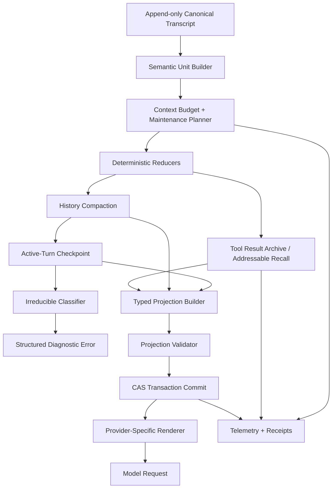

# Reasonix 长会话上下文压缩 V2：长期根因修复最佳实践实施方案

> **文档状态**：可实施技术设计 / Implementation Blueprint
> **目标仓库**：`isslayne/DeepSeek-Reasonix`
> **目标分支**：`fix/active-turn-checkpoint-compaction`（直接在该分支持续实施，不要求合并到 `main-v2`）
> **审查基线**：`main-v2@f731633314d80b1d36e50ef2270907e8a450727c`
> **当前分支审查 HEAD**：`b17818b73fe7e70f80868ce963d65b260266cba3`
> **日期**：2026-08-26
> **适用场景**：Reasonix + OpenAI-compatible provider，尤其是 oMLX、本地 Qwen3.8、DeepSeek 类长工具循环、长时间单用户任务

---

## 目录

1. [执行摘要](#1-执行摘要)
2. [问题现象与根因链路](#2-问题现象与根因链路)
3. [当前方案审计结论](#3-当前方案审计结论)
4. [目标、非目标与不可破坏的不变量](#4-目标非目标与不可破坏的不变量)
5. [最终目标架构](#5-最终目标架构)
6. [五层上下文维护流水线](#6-五层上下文维护流水线)
7. [核心数据模型](#7-核心数据模型)
8. [语义单元解析与工具协议安全](#8-语义单元解析与工具协议安全)
9. [可回溯的工具结果清理与地址化召回](#9-可回溯的工具结果清理与地址化召回)
10. [历史轮次压缩](#10-历史轮次压缩)
11. [Rolling Active-Turn Checkpoint](#11-rolling-active-turn-checkpoint)
12. [结构化 checkpoint 与摘要质量保障](#12-结构化-checkpoint-与摘要质量保障)
13. [Provider 窗口预算与摘要准入](#13-provider-窗口预算与摘要准入)
14. [Prefix Cache 性能策略](#14-prefix-cache-性能策略)
15. [事务提交、并发控制与故障恢复](#15-事务提交并发控制与故障恢复)
16. [不可约上下文与错误模型](#16-不可约上下文与错误模型)
17. [可观测性与性能指标](#17-可观测性与性能指标)
18. [文件级实施清单](#18-文件级实施清单)
19. [分阶段实施顺序](#19-分阶段实施顺序)
20. [测试与验收矩阵](#20-测试与验收矩阵)
21. [真实 oMLX 长会话验证方案](#21-真实-omlx-长会话验证方案)
22. [灰度、回滚与配置建议](#22-灰度回滚与配置建议)
23. [风险清单及缓解措施](#23-风险清单及缓解措施)
24. [Definition of Done](#24-definition-of-done)
25. [建议提交序列](#25-建议提交序列)
26. [实施检查表](#26-实施检查表)
27. [外部最佳实践与研究依据](#27-外部最佳实践与研究依据)

---

## 1. 执行摘要

Reasonix 当前长会话失败的根因不是简单的 `context_window` 数值太小，也不是 `compact_ratio` 配置不合理，而是自动压缩规划器把整个正在执行的用户轮次视为不可折叠区域：当历史完成轮次已被压缩后，长工具循环的大部分上下文都位于同一个 active user turn 内，规划器会找不到任何可折叠前缀，最终出现：

```text
context is above the maintenance threshold but no foldable region remains
```

附件中的初始方案提出了正确的核心能力：**rolling active-turn checkpoint compaction**。其正确原则包括：历史优先、原始用户任务原文保留、工具调用与结果成组处理、canonical transcript 不修改、只改变 model-visible projection、滚动替换旧 checkpoint、摘要请求受 provider 真实窗口约束。

但要达到长期生产级最佳实践，不能只增加一次 LLM 摘要。最终方案应升级为以下五层闭环：

```text
L0 预算准入与提前维护
    ↓
L1 语义单元解析
    ↓
L2 可回溯的确定性清理
   （旧 reasoning、旧 tool_result、重复大输出、地址化归档）
    ↓
L3 历史完成轮次压缩
    ↓
L4 Rolling Active-Turn Checkpoint
    ↓
L5 明确的 Irreducible Failure
   （不能安全压缩时停止重试并给出诊断）
```

最终实现必须满足四个关键要求：

1. **修复是直接提交的生产代码**，CI 只验证，不能在 GitHub Actions 中临时修改源码后再尝试自动提交。
2. **先无损/可回溯清理，再使用有损摘要**，避免把全部恢复能力押在 LLM 摘要准确性上。
3. **checkpoint 是结构化内部状态，不靠文本标签识别**；provider 所需的 synthetic message 只是渲染层产物。
4. **任何重试都必须以 projection generation 或 input hash 的真实进展为前提**，否则返回结构化不可约错误，禁止 maintenance 死循环。

---

## 2. 问题现象与根因链路

### 2.1 用户侧现象

在 Reasonix 通过 oMLX 调用本地 Qwen3.8 的长会话中，常见现象包括：

- 初始若干轮速度正常，随后 prompt 越来越大；
- prefix cache 命中率、prefill 时间和首 token 延迟逐渐恶化；
- 一个用户任务中持续执行多轮工具调用时，历史几乎全部属于同一 active turn；
- 达到维护阈值后反复触发 context maintenance；
- 最终出现：

```text
context exceeds provider limit and compaction failed:
context is above the maintenance threshold but no foldable region remains
```

或者：

```text
estimated prompt ... leaves no shared-window output budget
```

### 2.2 根因链路

当前旧路径的核心行为可以抽象为：

```text
planCompaction(...)
    ↓
得到计划 fold 前缀 [head, plannedEnd)
    ↓
planFoldRegion() 将 plannedEnd 截断到 activeTurnStart
    ↓
历史轮次已压缩后：plannedEnd == activeTurnStart
    ↓
[head, plannedEnd) 为空或没有经济收益
    ↓
CompactionNoop / no foldable region remains
```

这条链路说明，问题不是“压缩发生得太晚”这么简单，而是：

> **系统缺失一个位于仍在运行的用户轮次内部、且满足工具协议安全性的自动折叠边界。**

### 2.3 为什么只改参数不能根治

以下做法只能延迟失败：

- 调高 context window；
- 调低或调高 compact ratio；
- 减少 `max_tokens`；
- 增大 recent tail；
- 每隔若干轮手动 `/compact`；
- 直接截断最早消息。

当一个单独 active turn 足够长时，无论窗口是 32K、64K、128K 还是更大，最终都会再次到达同一结构性边界。

### 2.4 第二层根因：摘要请求自身也受窗口约束

即使找到了 active-turn 内可压缩区域，摘要请求仍需要占用：

```text
system / instructions
+ 原始任务锚点
+ 待摘要内容
+ 消息 framing
+ 摘要输出预算
+ provider protocol reserve
```

因此可能出现“原请求超窗，同时摘要请求也超窗”。如果 planner 和实际发送阶段采用不同预算模型，就会出现：

```text
planner: 可压缩
sender: no shared-window output budget
```

所以根治方案必须统一：

- 有效窗口学习；
- prompt token 估算；
- 摘要输出预算；
- provider tool schema 是否携带；
- protocol margin；
- 最终发送准入。

---

## 3. 当前方案审计结论

### 3.1 正确且必须保留的部分

当前 `compact_active_turn.go` 中的设计方向应保留：

- `history-first`；
- active turn 只作为 fallback；
- 原始 active user request 保留原文；
- 后续真实用户消息是硬边界；
- `assistant(tool_calls) + tool(results)` 是原子组；
- 未完成工具组不可折叠；
- canonical transcript 不修改；
- projection 使用 compare-and-swap / generation 防止过期提交；
- 后续 checkpoint 应覆盖旧 checkpoint，而不是不断叠加 wrapper。

### 3.2 当前实现必须纠正的部分

#### A. 新 planner 尚未直接接入正式生产源文件

当前分支中 `compact_active_turn.go` 已存在，但 `compact_projection.go` 正式路径仍采用旧 `planFoldRegion()`。新的生产修改主要存在于 Python patcher 中，而不是最终可构建源码中。

#### B. 自修改 CI 不符合长期维护要求

当前 workflow 会在 Runner 中：

- 执行 Python patcher；
- 改写生产 Go 文件；
- 改写测试；
- 只有测试通过才自动 commit。

这会产生三份不同状态：

```text
GitHub 分支源码
CI 临时 working tree
开发者本地构建源码
```

CI 必须改为只验证已经提交的源码。

#### C. 极小窗口测试的预期不合理

900-token 窗口中，摘要 prompt 本身可能已超过窗口。此时系统不能强行保证成功，应返回明确的不可约错误，而不是继续重试或让测试要求“必须完成”。

#### D. 第二次 overflow 未形成稳定滚动进展

第一次 checkpoint 后，第二次 overflow 仍可能出现：

```text
summaries=1 applied=1
```

需要重新设计 projection-to-canonical 覆盖映射、checkpoint generation 和 progress key。

#### E. 内部状态依赖 magic string

当前通过：

```text
<active-turn-checkpoint>
```

识别 checkpoint，容易与用户、模型或工具文本碰撞。应使用 typed metadata。

#### F. tool call ID 异常时不应仅按数量认定完整

ID 为空或重复时，简单判断 `len(results) >= len(calls)` 可能把错误结果组判为完成。安全边界必须 fail closed。

---

## 4. 目标、非目标与不可破坏的不变量

### 4.1 目标

1. 长时间单用户任务可以在同一 active turn 中持续执行，不因历史折叠边界缺失而失败。
2. 常规路径尽可能保持 prefix cache 的 append-only 特性。
3. 压缩不会导致工具协议失配、工具重复执行或不可逆副作用重复发生。
4. 任何 checkpoint 都能说明自己覆盖了哪段 canonical history，并可校验来源哈希。
5. provider 返回真实 context limit 后，Reasonix 能学习有效窗口并使用同一预算模型完成恢复。
6. 无法安全压缩时，快速、明确、可诊断地失败，不进入循环。
7. canonical transcript、审计记录和完整工具结果保持可回溯。

### 4.2 非目标

- 不承诺任何上下文状态都能被压缩成功；
- 不通过删除 canonical transcript 来换取窗口；
- 不把用户原始任务完全替换为模型摘要；
- 不把旧工具结果永久丢弃；
- 不依赖提高模型 context window 掩盖根因；
- 不要求把该分支合并到 `main-v2`；
- 不在本阶段训练专用 compaction 模型。

### 4.3 安全不变量

以下条件必须由代码和测试共同保证：

```text
INV-01 canonical transcript byte-identical
INV-02 original active user task exactly once in model-visible projection
INV-03 no orphan tool result
INV-04 no incomplete tool group in checkpoint
INV-05 no crossing a later real user-authored turn
INV-06 no progress, no retry
INV-07 checkpoint candidate must reduce tokens
INV-08 checkpoint candidate must fit effective provider window
INV-09 completed side-effect receipts remain exact and addressable
INV-10 synthetic control items are never treated as user-authored messages
INV-11 stale summary cannot overwrite a newer transcript/projection
INV-12 duplicate/empty tool IDs fail closed unless provider declares positional pairing
```

---

## 5. 最终目标架构



### 5.1 Canonical Transcript

Canonical transcript 是唯一完整事实源：

- append-only；
- 保留用户消息、assistant 输出、tool call、tool result；
- 保留完整归档引用；
- rewind/truncate 等操作继续使用现有会话语义；
- compaction 不直接改写 canonical message 数组。

### 5.2 Model-Visible Projection

Projection 是针对模型的可替换视图：

```text
稳定前缀
+ 精简后的历史/工具占位符
+ 一个 typed checkpoint
+ 最近原文 tail
+ canonical 新增尾部
```

### 5.3 Archive Store

Archive Store 保存被清理的完整工具输出和可选旧 reasoning：

- append-only；
- 内容哈希；
- session/workspace scope；
- 地址化读取；
- 不允许任意路径穿越；
- 可按 retention policy 清理，但不能在仍被 checkpoint 引用时删除。

### 5.4 Typed Checkpoint

Checkpoint 是内部结构，不是通过文本前缀识别的普通消息。只有 provider renderer 才把它转换成合法的 wire messages。

---

## 6. 五层上下文维护流水线

### 6.1 L0：预算准入与提前维护

每次 provider 调用前统一计算：

```text
effective_window
estimated_prompt_tokens
requested_output_tokens
minimum_output_reserve
protocol_margin
hard_input_ceiling
maintenance_trigger
```

建议定义两个阈值：

```text
pressure_trigger = effective_window * 0.80
emergency_trigger = effective_window - minimum_reply_reserve - protocol_margin
```

当估算 prompt 达到 `pressure_trigger` 时主动维护，不等 provider 400。

### 6.2 L1：语义单元解析

把 message 列表先解析成 semantic units，再规划边界，禁止直接按裸 message index 进行压缩。

### 6.3 L2：可回溯确定性清理

优先做无需 LLM 的处理：

1. 清理旧 `ReasoningContent` 的 model-visible 副本；
2. 归档旧 `tool_result`，替换为 compact placeholder；
3. 合并重复大输出；
4. 保留最近 K 个完整工具组原文；
5. 保留高风险/不可幂等工具 receipt；
6. 计算实际 reclaimed tokens。

### 6.4 L3：历史完成轮次压缩

若仍超阈值，优先压缩 active turn 之前的完整历史轮次。

### 6.5 L4：Rolling Active-Turn Checkpoint

只有以下条件同时满足时进入：

- 历史区域已耗尽或收益不足；
- active user task 后存在至少一个完整 semantic unit；
- 摘要请求可在 provider 窗口内完成；
- 新 checkpoint 覆盖范围大于旧 checkpoint；
- candidate 能产生真实 token 收益。

### 6.6 L5：Irreducible Failure

以下情况直接返回结构化不可约错误：

- system + original task 已接近或超过窗口；
- active turn 中只有未完成工具组；
- 单个不可拆分工具组大于窗口且无法归档；
- summary prompt + 最小输出预算无法适配窗口；
- summarizer 不可用且机械 fallback 不足；
- checkpoint 校验失败；
- 同一 input hash 已尝试过且没有 projection progress。

---

## 7. 核心数据模型

以下代码是建议接口形态，名称可按 Reasonix 现有风格调整。

### 7.1 Semantic Unit

```go
type ContextUnitKind uint8

const (
    UnitSystem ContextUnitKind = iota
    UnitUserTurn
    UnitAssistantText
    UnitToolGroup
    UnitCheckpoint
    UnitSyntheticControl
)

type ContextUnit struct {
    Kind ContextUnitKind

    VisibleStart  int
    VisibleEnd    int
    CanonicalFrom int
    CanonicalTo   int

    Messages []provider.Message

    Complete       bool
    UserAuthored   bool
    ProviderVisible bool
    EstimatedTokens int

    ToolGroup *ToolGroupReceipt
}
```

### 7.2 Tool Group Receipt

```go
type ToolSideEffectClass string

const (
    ToolReadOnly       ToolSideEffectClass = "read_only"
    ToolIdempotentWrite ToolSideEffectClass = "idempotent_write"
    ToolNonIdempotent  ToolSideEffectClass = "non_idempotent"
    ToolUnknownEffect  ToolSideEffectClass = "unknown"
)

type ToolCallReceipt struct {
    CallID        string
    ToolName      string
    ArgumentsHash string
    ArgumentsHint string
    Status        string
    ResultHash    string
    ArchiveRef    string
    SideEffect    ToolSideEffectClass
    ResourceIDs   []string
}

type ToolGroupReceipt struct {
    AssistantMessageIndex int
    Calls                 []ToolCallReceipt
    Complete              bool
    PairingMode           string // "id", "positional", "unknown"
}
```

### 7.3 Structured Checkpoint

```go
type ActiveTurnCheckpoint struct {
    SchemaVersion int `json:"schema_version"`

    ActiveTurnID       string `json:"active_turn_id"`
    OriginalTaskHash   string `json:"original_task_hash"`
    CanonicalStart     int    `json:"canonical_start"`
    CanonicalEnd       int    `json:"canonical_end"`
    CoveredSourceHash  string `json:"covered_source_hash"`
    Generation         uint64 `json:"generation"`

    StandingConstraints []string          `json:"standing_constraints"`
    CompletedOperations []ToolCallReceipt `json:"completed_operations"`
    Files               []CheckpointFile  `json:"files"`
    Decisions           []string          `json:"decisions"`
    Errors              []string          `json:"errors"`
    Pending             []string          `json:"pending"`
    NextAction          string            `json:"next_action"`

    Narrative string `json:"narrative"`
}
```

其中以下字段必须由程序生成，不允许模型自由填写：

```text
ActiveTurnID
OriginalTaskHash
CanonicalStart
CanonicalEnd
CoveredSourceHash
Generation
CompletedOperations 中的 call_id / result_hash / archive_ref
```

### 7.4 Projection Item

```go
type ProjectionItemKind uint8

const (
    ProjectionCanonicalRange ProjectionItemKind = iota
    ProjectionToolPlaceholder
    ProjectionCheckpoint
    ProjectionSyntheticControl
)

type ProjectionItem struct {
    Kind ProjectionItemKind

    CanonicalFrom int
    CanonicalTo   int

    Message     *provider.Message
    Placeholder *ToolResultPlaceholder
    Checkpoint  *ActiveTurnCheckpoint

    Synthetic bool
}
```

### 7.5 Compaction Plan

```go
type MaintenanceMode string

const (
    ModeNoop              MaintenanceMode = "noop"
    ModeToolResultClear   MaintenanceMode = "tool_result_clear"
    ModeHistorySummary    MaintenanceMode = "history_summary"
    ModeActiveCheckpoint  MaintenanceMode = "active_turn_checkpoint"
    ModeMechanicalFallback MaintenanceMode = "mechanical_fallback"
    ModeIrreducible       MaintenanceMode = "irreducible"
)

type CompactionPlan struct {
    Mode MaintenanceMode

    UnitsFrom int
    UnitsTo   int

    CanonicalFrom int
    CanonicalTo   int

    EstimatedSourceTokens    int
    EstimatedCandidateTokens int
    ExpectedReclaimTokens    int

    BreaksPromptCache bool
    KeepRecentUnits   int
    Force             bool

    Reason string
}
```

---

## 8. 语义单元解析与工具协议安全

### 8.1 解析规则

#### System

- system message 单独形成 pinned unit；
- 永不进入自动摘要删除范围；
- system 变化会使 projection 和 prompt cache key 失效。

#### Real User Turn

只有满足 Reasonix 现有 `IsUserAuthoredTurn` 语义且不是 synthetic/control/checkpoint 的消息，才算真实用户轮次。

#### Assistant Text

普通 assistant 文本可以单独成为 unit，但在 active turn 内建议与紧随的工具组按执行阶段组织。

#### Tool Group

一个 tool group 包含：

```text
assistant message with one or more tool calls
+ 所有对应 tool results
```

只有全部 call 都有对应 result 时才 `Complete=true`。

### 8.2 Tool Call ID 配对规则

优先级：

```text
1. 唯一非空 call_id 精确匹配
2. provider capability 明确声明 positional pairing
3. 否则 pairing unknown，fail closed
```

禁止使用：

```go
len(results) >= len(calls)
```

作为未知 ID 场景的唯一完整性判断。

### 8.3 后续真实用户消息

遇到后续真实用户 steer：

- active-turn checkpoint 不能跨越；
- 之前 active turn 已结束，应转为历史压缩；
- synthetic continuation 不得被识别为用户 steer。

### 8.4 LocalOnly 消息

`LocalOnly` 不进入 provider-visible token 预算，但不能破坏 semantic boundary 的 canonical index 映射。

### 8.5 高风险工具

以下工具默认 `exclude_from_destructive_compaction=true`，除非已有精确 receipt：

```text
git push / release
发送邮件或消息
删除、覆盖文件
数据库写入
创建、修改云资源
支付、订单、账户操作
任何非幂等外部副作用
```

---

## 9. 可回溯的工具结果清理与地址化召回

### 9.1 为什么必须先清理 tool results

长工具循环的主要 token 增长通常来自：

- 大文件内容；
- grep/search 输出；
- build/test 日志；
- GitHub API JSON；
- shell stdout/stderr；
- 大量重复诊断。

这些内容在执行当时有用，但很快会成为上下文负担。先清理它们比直接摘要整段会话更稳定、更便宜，也更容易验证。

### 9.2 Archive 流程

```text
完整 tool result
    ↓
计算 SHA-256、字节数、token 估算
    ↓
写入 session-scoped append-only archive
    ↓
fsync + atomic rename / append receipt
    ↓
在 projection 中替换为 placeholder
```

### 9.3 Placeholder 示例

```json
{
  "kind": "cleared_tool_result",
  "tool_call_id": "call_123",
  "tool_name": "read_file",
  "status": "success",
  "content_hash": "sha256:...",
  "archive_ref": "session://tool-results/call_123",
  "original_bytes": 182736,
  "summary": "Read internal/agent/compact_projection.go; full output archived."
}
```

### 9.4 地址化召回工具

建议增加一个只读内部工具：

```text
recall_context(ref, start?, max_bytes?)
```

约束：

- 只接受当前 session 生成的 opaque ref；
- 不接受任意文件路径；
- 单次最大返回量；
- 返回仍需经过 tool output truncation；
- 记录 recall receipt；
- 禁止通过 ref 访问其他 session。

### 9.5 清理策略

普通 pressure 模式建议：

```text
keep_recent_tool_groups = 3
clear_old_reasoning = true
clear_at_least_tokens = max(4096, effective_window * 0.05)
```

紧急模式：

- 可保留 1 个最近完整工具组；
- 若单组过大，先 archive result，再保留 receipt；
- 不能归档或 pairing 不确定时，返回 irreducible。

### 9.6 ReasoningContent

旧 reasoning 不应作为长期事实载体。建议：

- canonical 可继续保留现有数据；
- model-visible projection 清理旧 reasoning；
- 最近 1 个执行阶段可按 provider 要求保留；
- checkpoint 只保存结论、约束、证据和 next action，不保存逐 token 推理轨迹。

---

## 10. 历史轮次压缩

### 10.1 优先级

只要 active turn 之前仍存在有经济收益的历史区域，就优先历史压缩。

### 10.2 Cache-Aligned 模式

常规历史摘要尽量维持：

```text
tools
+ system
+ byte-identical historical prefix
+ one compaction instruction
```

这样摘要请求可以复用已有 prefix cache。

### 10.3 Bounded Non-Prefix Fallback

若 provider 已学习到更小 shared window，cache-aligned summary request 仍可能过大。此时可以降级为：

```text
system
+ 需要摘要的历史 semantic units
+ compact instruction
```

但必须：

- telemetry 标记 cache break；
- 要求更高的最小回收 token；
- 不与 active-turn 模式混淆；
- 不携带不可用 tool schemas。

### 10.4 历史摘要结构

保留现有稳定 headings，但将程序生成 receipts 附加在模型摘要之外，避免模型漏掉高风险事实。

---

## 11. Rolling Active-Turn Checkpoint

### 11.1 投影目标形态

逻辑 projection：

```text
system
original active user task (verbatim)
structured active-turn checkpoint
synthetic continuation control
recent live semantic units (verbatim)
new canonical tail
```

### 11.2 Normal Pressure

正常压力下：

- 保留最新一个完整工具组作为 live anchor；
- 只 checkpoint 更早的 completed active-turn units；
- 不折叠 in-flight group；
- 要求满足 minimum reclaim；
- checkpoint 后不立即再次触发，使用 hysteresis。

### 11.3 Physical Overflow / Force

provider 已返回 context limit 或本地 admission 判定即将硬溢出时：

- 可 checkpoint 最新完整工具组；
- 但必须先保存精确 tool receipt；
- 非幂等工具的 call ID、参数哈希、状态和资源 ID 必须保留；
- 若最新组未完成，禁止压缩；
- 若精确 receipt 无法构建，返回 irreducible。

### 11.4 滚动更新

第一次 checkpoint：

```text
covered canonical [A, B)
generation = 1
```

后续新增工作到达 C，再次 checkpoint：

```text
summary input = prior checkpoint structured state + canonical [B, C)
new covered canonical [A, C)
generation = 2
```

必须保证：

```text
newCanonicalEnd > oldCanonicalEnd
newCoveredHash != oldCoveredHash
newProjectionInputHash != oldProjectionInputHash
```

否则视为无进展，不允许提交。

### 11.5 一个 checkpoint 原则

model-visible projection 中同一 active turn 最多存在一个 typed checkpoint。旧 checkpoint 是 summary input，不作为独立 wrapper 继续保留。

### 11.6 Synthetic Control

内部必须使用：

```go
Synthetic: true
Kind: ProjectionSyntheticControl
```

provider renderer 可根据协议映射成 user/assistant 文本，但：

- 不写入 canonical；
- 不计入用户轮次；
- 不参与 activeTurnStart；
- 不可成为 `/compact` anchor；
- UI 默认隐藏或显示为 maintenance event；
- policy/guardian 不得当作用户指令。

---

## 12. 结构化 checkpoint 与摘要质量保障

### 12.1 模型只负责 narrative 字段

程序负责：

- 范围；
- hash；
- tool receipts；
- 文件变更 receipts；
- generation；
- active turn identity。

模型负责：

- standing constraints 的自然语言整理；
- decisions；
- unresolved errors；
- pending；
- next action；
- concise narrative。

### 12.2 Structured Output

优先让 summarizer 输出 JSON：

```json
{
  "standing_constraints": [],
  "decisions": [],
  "errors": [],
  "pending": [],
  "next_action": "",
  "narrative": ""
}
```

如果 provider 不支持 structured output：

1. 使用严格 JSON prompt；
2. 本地解析；
3. schema 校验；
4. 失败不自动重复多次；
5. 进入 mechanical fallback 或 irreducible。

### 12.3 Required Facts Validator

程序应生成 `required facts`：

```text
原始任务 hash
高风险 tool receipt IDs
最近文件变更
明确用户纠正
未解决错误 code
```

checkpoint 提交前验证：

- 所有高风险 receipt 均存在；
- 模型没有生成不存在的 tool ID；
- canonical coverage hash 匹配；
- summary 长度在预算内；
- next action 不声明任务已经完成，除非 canonical 有完成证据。

### 12.4 Mechanical Fallback

当 summarizer 不可用但结构化 receipts 足够时，可生成确定性 checkpoint：

```text
Original task: exact reference
Completed operations: exact receipts
Files changed: exact receipts
Errors: exact error records
Pending: retained from latest structured task state
Recent tail: verbatim
```

Mechanical fallback 不试图总结完整分析过程。若缺少足够状态，宁可返回 irreducible，也不能制造虚假连续性。

---

## 13. Provider 窗口预算与摘要准入

### 13.1 统一预算对象

建议新增：

```go
type RequestBudget struct {
    EffectiveWindow int
    EstimatedPrompt int
    RequestedOutput int
    EffectiveOutput int
    ProtocolMargin  int
    HardInputCeiling int
    WindowMode provider.ContextWindowMode
    Source string // configured / learned / provider
}
```

普通采样、历史摘要、active checkpoint 必须共用同一预算计算器。

### 13.2 Effective Window

```text
effective_window = min(configured_window, learned_window)
```

若只有其中一个已知，则使用已知值。

Provider 返回 `ContextLimitError` 后：

- 保存 observed window；
- 保存 observed prompt/completion；
- 标记 shared-window；
- 后续 planner 和 sender 立即使用 learned window；
- learned state 必须与 provider/model/cache key 绑定，避免跨模型污染。

### 13.3 摘要输出预算

建议默认：

```text
history_summary_max = min(8192, provider_max_output)
active_checkpoint_desired = clamp(512, effective_window * 0.02, 2048)
active_checkpoint_min = 256
protocol_margin = clamp(256, effective_window * 0.005, 1024)
```

这些值是起始值，应通过真实 oMLX 日志校准。

### 13.4 准入公式

```text
estimated_summary_prompt
+ effective_summary_output
+ protocol_margin
<= effective_window
```

若不成立：

1. 减少 summary fold 范围，必须按 semantic unit 边界二分；
2. 降低输出预算，但不得低于 minimum；
3. 移除 summary request 中无用 tool schemas；
4. 尝试 deterministic reducers；
5. 仍不成立则 irreducible。

### 13.5 不能按裸消息二分

`maximumSafeSummaryPrefixEnd()` 应改为对 semantic units 二分，避免：

- 截断 assistant/tool group；
- 截断并行工具结果；
- 把 synthetic control 当作边界；
- 在 checkpoint wrapper 内部切割。

### 13.6 Tool Schema 策略

```text
历史 cache-aligned summary：保留 tool schemas，以复用缓存
active bounded checkpoint：不发送 tool schemas
mechanical fallback：不调用 provider
```

摘要指令必须明确禁止工具调用。

---

## 14. Prefix Cache 性能策略

### 14.1 正常路径

正常 agent 请求继续 append-only：

```text
stable tools
stable system
stable prior messages
new tail
```

### 14.2 Cache Break 只在收益足够时发生

普通 pressure 维护必须满足：

```text
expected_reclaim >= clear_at_least_tokens
```

建议：

```text
clear_at_least_tokens = max(4096, effective_window * 0.05)
```

### 14.3 Active Checkpoint 的定位

Active checkpoint 是紧急恢复点，允许一次显式 cache reset，但必须：

- telemetry 标记 `breaks_prompt_cache=true`；
- checkpoint 后建立新的稳定 prefix；
- 使用 cooldown/hysteresis，避免每轮重写；
- 下一次 checkpoint 必须覆盖新的 canonical work。

### 14.4 Hysteresis

建议：

```text
触发阈值：80%
维护目标：60%～65%
再次允许维护：至少新增 5% window 或达到 emergency trigger
```

### 14.5 Telemetry 模式

禁止把所有摘要都标记为 `cache_prefix`。建议枚举：

```text
history_cache_aligned
history_bounded_nonprefix
active_checkpoint_nonprefix
mechanical_fallback
lossless_tool_clear
irreducible
```

---

## 15. 事务提交、并发控制与故障恢复

### 15.1 Snapshot

发起远程摘要前记录：

```text
canonical transcript version
canonical length
covered source hash
projection generation
projection version
active turn ID / CreatedAt
prompt cache key
provider/model identity
maintenance attempt key
```

### 15.2 远程摘要期间不持有会话写锁

避免阻塞工具执行或 UI，但摘要返回后必须重新获取锁并执行 CAS。

### 15.3 CAS 条件

提交前全部满足：

```text
transcriptVersion unchanged
activeTurnID unchanged
projectionGeneration unchanged
promptCacheKey unchanged
coveredSourceHash unchanged
newCanonicalEnd > oldCanonicalEnd (rolling mode)
```

任一失败：

- 丢弃摘要；
- 记录 `stale_context`；
- 不修改 canonical；
- 不直接重试，等待下一次 maintenance decision。

### 15.4 Atomic Persistence

若 projection/receipt 有 sidecar：

```text
write temp
fsync file
atomic rename
fsync directory（支持的平台）
update in-memory state
emit applied event
```

或者先完成现有 `commitSummaryProjection` 的原子状态更新，再异步持久化，但必须保证崩溃恢复语义明确。

### 15.5 Recovery / Rollback

如果 replacement 失败：

- 保留旧 projection；
- 不清空 session history；
- 抛出原始错误；
- 记录 rollback 是否成功；
- 禁止部分应用新 projection。

### 15.6 Progress-Aware Retry

定义：

```go
type MaintenanceAttemptKey struct {
    InputHash       string
    ProjectionGen   uint64
    EffectiveWindow int
    Trigger         string
}
```

相同 key 失败后不再重试。只有以下情况允许新重试：

- canonical 新增；
- projection generation 增加；
- learned window 改变；
- summarizer/provider 状态改变且由显式用户操作触发。

---

## 16. 不可约上下文与错误模型

### 16.1 新错误类型

```go
var ErrContextIrreducible = errors.New("context cannot be reduced safely")

type IrreducibleReason string

const (
    IrreducibleImmutableAnchorTooLarge IrreducibleReason = "immutable_anchor_too_large"
    IrreducibleNoCompletedUnit          IrreducibleReason = "no_completed_unit"
    IrreducibleInflightToolGroup        IrreducibleReason = "inflight_tool_group"
    IrreducibleSummaryRequestTooLarge   IrreducibleReason = "summary_request_too_large"
    IrreducibleSummarizerUnavailable    IrreducibleReason = "summarizer_unavailable"
    IrreducibleNoTokenSavings           IrreducibleReason = "no_token_savings"
    IrreducibleCheckpointInvalid        IrreducibleReason = "checkpoint_invalid"
    IrreducibleNoProjectionProgress     IrreducibleReason = "no_projection_progress"
    IrreducibleUnsafeToolPairing        IrreducibleReason = "unsafe_tool_pairing"
)
```

### 16.2 诊断载荷

```go
type IrreducibleContextError struct {
    Reason IrreducibleReason

    EffectiveWindow       int
    EstimatedPrompt       int
    ImmutableAnchorTokens int
    LargestAtomicUnit     int
    SummaryPromptTokens   int
    MinimumOutputTokens   int
    ProtocolMargin        int

    InflightToolCalls int
    InputHash         string
    ProjectionGen     uint64
}
```

### 16.3 用户可见消息

示例：

```text
Context cannot be compressed safely.
The immutable system/task anchor and the current in-flight tool group require
24,812 tokens, but the learned provider window is 24,000 tokens.
No conversation data was deleted. Complete/cancel the current tool call or start
a new turn with a shorter task anchor.
```

### 16.4 900-token 测试的正确预期

若：

```text
summary prompt = 1015
window = 900
```

测试应断言：

- 返回 `ErrContextIrreducible`；
- reason 为 `summary_request_too_large` 或 `immutable_anchor_too_large`；
- 不重复 maintenance；
- canonical 未修改；
- provider 不收到无限重试。

不应要求该场景强行成功。

---

## 17. 可观测性与性能指标

### 17.1 每次 maintenance event

至少记录：

```text
trigger
mode
source_tokens
candidate_tokens
reclaimed_tokens
fold_units
covered_canonical_from/to
projection_generation
breaks_prompt_cache
summary_prompt_tokens
summary_output_tokens
summary_latency_ms
archive_bytes
archive_refs_count
kept_recent_tool_groups
provider_window_source
irreducible_reason
```

### 17.2 每次模型请求

记录：

```text
prompt_tokens
cache_hit_tokens
cache_miss_tokens
cache_write_tokens
prefill_ms（若 provider 暴露）
first_token_latency_ms
output_tokens
tokens_per_second
projection_generation
cache_generation
```

### 17.3 关键派生指标

```text
checkpoint_frequency
average_tokens_reclaimed
checkpoint_success_rate
checkpoint_stale_rate
maintenance_no_progress_count
cache_rebuild_cost_after_checkpoint
requests_until_cache_rate_recovers
irreducible_rate
archive_recall_rate
repeated_tool_call_after_checkpoint
```

### 17.4 日志必须可区分

```text
pressure maintenance
provider-overflow recovery
history summary
active checkpoint
mechanical fallback
irreducible failure
```

---

## 18. 文件级实施清单

下面按照当前 Reasonix 结构给出建议变更。

### 18.1 删除一次性交付机制

最终源码稳定后删除：

```text
.github/workflows/apply-active-turn-compaction.yml
tools/apply_active_turn_compaction.py
tools/update_active_turn_compaction_contract.py
tools/update_active_turn_force_boundary.py
tools/update_active_turn_summary_request.py
tools/debug_active_turn_overflow.py
```

CI 不再写回分支。

### 18.2 `internal/agent/compact_units.go`（新增）

职责：

- message → semantic units；
- tool group pairing；
- real user / synthetic control 分类；
- unit token estimates；
- safe boundaries。

主要接口：

```go
func (a *Agent) buildContextUnits(msgs []provider.Message) ([]ContextUnit, error)
func completedUnitPrefix(units []ContextUnit, start, limit int) int
func validateToolGroup(group ContextUnit) error
```

### 18.3 `internal/agent/tool_result_archive.go`（新增）

职责：

- archive write/read；
- SHA-256；
- placeholder；
- retention；
- session-scoped ref validation；
- recall tool backend。

### 18.4 `internal/agent/compact_active_turn.go`（重构）

保留：

- history-first；
- active fallback；
- original task anchor；
- rolling checkpoint。

删除或替换：

- 文本标签作为内部身份；
- count-only tool matching；
- raw message index boundary；
- 普通 `provider.Message` 直接充当 synthetic state。

新增：

```go
func (a *Agent) planActiveTurnCheckpoint(units []ContextUnit, budget RequestBudget, force bool) (CompactionPlan, error)
func buildActiveTurnCheckpoint(...)
func rollCheckpoint(...)
```

### 18.5 `internal/agent/compact_projection.go`

直接提交生产集成：

- 调用统一 `planContextMaintenance()`；
- 先执行 deterministic reducers；
- 再 history / active checkpoint；
- 使用 typed projection builder；
- 使用统一 budget；
- 使用 CAS；
- progress-aware retry；
- irreducible classification。

删除旧的双轨 planner wrapper，避免旧 `planFoldRegion` 与新 planner 同时存在。

### 18.6 `internal/agent/compact.go`

调整：

- `summaryRequest` 接收显式 mode；
- active summary 不带 tool schemas；
- history cache-aligned summary 保持稳定 prefix；
- structured summary schema；
- mechanical fallback；
- summary output budget 动态化；
- reasoning clearing policy。

建议接口：

```go
type SummaryRequestMode string

const (
    SummaryHistoryCacheAligned SummaryRequestMode = "history_cache_aligned"
    SummaryHistoryBounded      SummaryRequestMode = "history_bounded"
    SummaryActiveCheckpoint    SummaryRequestMode = "active_checkpoint"
)

func (a *Agent) summaryRequest(region []provider.Message, instructions string, mode SummaryRequestMode) provider.Request
```

### 18.7 `internal/agent/output_budget.go`

抽取统一：

```go
func (a *Agent) requestBudget(req provider.Request, purpose RequestPurpose) (RequestBudget, error)
func (a *Agent) fitSummaryRequest(...)
```

避免 active summary 自己实现一套与正常 admission 不同且容易漂移的公式。

### 18.8 `internal/agent/context_recovery.go`

修改：

- provider 400 后学习窗口；
- 先判断是否只是 output budget 过大；
- 需要压缩时调用统一 maintenance；
- 仅当 projection 产生真实进展才 retry；
- 相同 attempt key 最多一次；
- irreducible 原样返回，不包装成模糊错误。

### 18.9 `internal/agent/context_status.go`

新增：

- maintenance mode；
- projection generation；
- irreducible reason；
- cache break；
- reclaimed tokens；
- archive stats；
- learned window source。

### 18.10 Projection persistence 相关文件

在现有 `CompactionState` / projection sidecar 中增加：

```text
schema_version
active_turn_id
checkpoint_generation
covered_source_hash
projection_items
archive_refs
maintenance_mode
```

必须兼容旧 sidecar：

- 旧文本 summary 可以迁移为 `ProjectionCheckpointLegacy`；
- 不尝试从用户/工具普通文本中猜测 active checkpoint；
- 新版本写入 schema v2。

### 18.11 Provider renderer

新增 provider-agnostic typed projection 渲染层：

```go
func renderProjection(items []ProjectionItem, caps ProviderCapabilities) []provider.Message
```

严格交替角色 provider 与宽松 provider 可使用不同 wire shape，但内部语义一致。

---

## 19. 分阶段实施顺序

### Phase 0：清理交付状态

目标：让分支源码就是实际构建源码。

1. 在本地/工作分支直接应用当前正确的 production patch；
2. 修正现有测试，不再由 Python 脚本修改；
3. 删除自修改 workflow；
4. 删除 patcher/debug 脚本；
5. 确认 `git diff` 中包含真实 Go 源码变更；
6. 运行基础测试。

**退出条件**：普通 checkout 后无需任何脚本即可构建和运行新 planner。

### Phase 1：Semantic Units

1. 新增 unit builder；
2. 完成工具组 ID 配对；
3. synthetic/user-authored 分离；
4. 用 unit boundary 替换 message boundary；
5. 添加 fail-closed tests。

**退出条件**：所有 fold 边界都基于 unit。

### Phase 2：Deterministic Reducers + Archive

1. reasoning 清理；
2. tool result archive；
3. placeholder；
4. keep recent groups；
5. addressable recall；
6. minimum reclaim。

**退出条件**：多数长工具日志无需 LLM summary 即可释放大量 token。

### Phase 3：Typed History / Active Checkpoint

1. typed checkpoint；
2. provider renderer；
3. original task exact once；
4. rolling generation；
5. side-effect receipts；
6. one-checkpoint invariant。

### Phase 4：Unified Budget + Irreducible

1. 统一 request budget；
2. learned window；
3. dynamic summary output；
4. semantic-unit binary fit；
5. explicit irreducible errors；
6. progress-aware retry。

### Phase 5：Telemetry + Cache Performance

1. mode-aware telemetry；
2. cache break generation；
3. hysteresis；
4. dashboard/log fields；
5. benchmark。

### Phase 6：真实 oMLX 回放

1. 使用原始 Reasonix 使用轨迹；
2. 30、60、100+ 工具轮次；
3. 多次 overflow；
4. cache recovery；
5. MTP/tok/s 变化；
6. 故障注入。

---

## 20. 测试与验收矩阵

### 20.1 Unit Builder

| 测试 | 断言 |
|---|---|
| 单工具调用完整 | 一个完整 ToolGroupUnit |
| 并行多工具完整 | 所有 call ID 均有 result |
| 缺少一个 result | group incomplete，不可 fold |
| 重复 call ID | unsafe pairing，fail closed |
| 空 call ID | provider 未声明 positional 时 fail closed |
| LocalOnly 穿插 | 不破坏 canonical/visible 映射 |
| 后续真实 user steer | active fold 停止 |
| synthetic continuation | 不算 user-authored |

### 20.2 Deterministic Clearing

| 测试 | 断言 |
|---|---|
| 64KiB/256KiB tool result | projection 大小近似固定 |
| archive 回读 | hash 完全一致 |
| 非法 archive ref | 拒绝访问 |
| 跨 session ref | 拒绝访问 |
| clear_at_least 不足 | 不打断 cache |
| 最近 K 组 | 原文保留 |
| 高风险工具 | receipt 不可被清除 |

### 20.3 History Compaction

- history-first；
- cache-aligned request byte-identical；
- bounded fallback 模式标记正确；
- candidate token 必须下降；
- canonical byte-identical。

### 20.4 Active Checkpoint

- 无历史前缀时进入 active mode；
- original task 恰好一次；
- checkpoint 恰好一个；
- synthetic control 不进入 canonical；
- recent live group 保留；
- 未完成 group 不折叠；
- force 模式只折叠完整 group；
- high-risk receipts 完整。

### 20.5 Rolling Checkpoint

建议测试：

```text
TestActiveCheckpointRecoversTwoOverflows
TestActiveCheckpointRecoversFiveOverflows
TestRollingCheckpointAdvancesCoverage
TestRollingCheckpointDoesNotAccumulateWrappers
TestRollingCheckpointRejectsNoProgressRewrite
```

断言：

```text
summaries >= overflow count（允许 deterministic clear 减少摘要次数）
每个需要摘要的 overflow 后恰好一次 retry
covered canonical end 单调递增
projection generation 单调递增
相同 input hash 不重复 maintenance
```

### 20.6 Budget

- configured 64K / learned 24K；
- summary planner 与 sender 估算一致；
- active request 不带 tool schemas；
- 900-token 场景返回 irreducible；
- minimum output 不足时 fail；
- CJK token calibration；
- reasoning round-trip 计入估算；
- provider unknown → learned shared window。

### 20.7 Concurrency / Race

- 摘要期间新增 canonical message；
- 摘要期间 rewind；
- projection generation 被其他维护更新；
- cancel / timeout；
- 两个 maintenance 并发；
- archive 写入失败；
- persistence rename 失败；
- rollback 失败日志。

执行：

```bash
go test -race ./internal/agent -run 'Test.*Compaction|Test.*Checkpoint|Test.*ContextRecovery' -count=20
```

### 20.8 全仓库

```bash
git diff --check
gofmt -w <changed-go-files>
go vet ./...
go test ./internal/agent -count=1 -timeout=15m
go test -race ./internal/agent -count=1 -timeout=30m
go test ./... -count=1 -timeout=30m
go run ./tools/repolint
```

普通 CI、coverage、Linux、macOS、Windows 必须全部通过。

---

## 21. 真实 oMLX 长会话验证方案

### 21.1 环境

- Reasonix：`fix/active-turn-checkpoint-compaction` 最终源码；
- Provider：oMLX；
- 模型：当前实际使用的 Qwen3.8 模型 ID；
- 保持现有 MTP、max_tokens、context 配置；
- 客户端确认是 Reasonix，不混用 Goose 日志。

### 21.2 回放任务

构造真实编码任务，持续：

```text
读取多个大文件
搜索代码
修改文件
运行测试
分析日志
再次修改
重复 60～100 个工具 round
```

至少包含：

- 多个大 tool results；
- 一次失败命令；
- 一次用户中途纠正；
- 两次以上 context pressure；
- 一次模拟 provider context limit；
- 一个 non-idempotent mock tool receipt。

### 21.3 采集字段

从 Reasonix：

```text
maintenance mode
source/candidate/reclaimed tokens
projection generation
covered canonical range
cache break
summary latency
irreducible reason
```

从 oMLX：

```text
prompt tokens
cache hit/miss
prefill time
first token latency
tok/s
MTP accept rate
tokens/cycle
finish reason
```

### 21.4 成功标准

1. 不再出现：

```text
no foldable region remains
```

2. 两次以上 overflow 均能产生真实 progress 或明确 irreducible；
3. 不出现相同 input hash 的重复维护循环；
4. canonical transcript 未缩短；
5. checkpoint 后模型不会重复已完成的高风险工具；
6. tool result archive 可回读；
7. checkpoint 后一到数轮内 prefix cache 重新稳定；
8. 长会话 prompt tokens 呈锯齿受控，而不是单调无界增长；
9. 平均 tok/s 不因频繁 checkpoint 持续下降；
10. maintenance 总延迟可接受。

### 21.5 性能对照组

至少对比：

```text
A. main-v2 原始逻辑
B. 仅 active-turn LLM summary
C. V2 混合方案（deterministic clear + structured checkpoint）
```

比较：

```text
任务成功率
总耗时
provider 请求数
summary 请求数
cache hit rate
平均 prefill
P95 first-token latency
总输入 token
重复工具调用数
```

---

## 22. 灰度、回滚与配置建议

### 22.1 Feature Flags

```text
context_compaction_v2
context_lossless_tool_clear
context_addressable_recall
context_active_checkpoint_v2
context_mechanical_fallback
```

### 22.2 推荐起始配置

```toml
[context_maintenance]
enabled = true
compact_ratio = 0.80
target_ratio = 0.62
emergency_ratio = 0.92

keep_recent_tool_groups = 3
clear_old_reasoning = true
clear_at_least_tokens = 4096

active_checkpoint_min_output_tokens = 256
active_checkpoint_max_output_tokens = 2048

archive_tool_results = true
addressable_recall = true

max_same_input_attempts = 1
```

对不同窗口可在运行时计算动态值；配置只作为下限/上限。

### 22.3 Shadow Planner

第一阶段可启用 shadow mode：

- 新 planner 只记录计划，不提交；
- 与旧 planner 对比 fold boundary；
- 检查是否会跨工具组；
- 收集预估 reclaimed tokens。

### 22.4 灰度顺序

```text
1. 单元/CI
2. 本地 mock provider
3. 本地 oMLX 单会话
4. 真实项目长工具循环
5. 默认开启 deterministic clear
6. 默认开启 history summary
7. 最后开启 active checkpoint
```

### 22.5 回滚

回滚开关应做到：

- 禁用新 planner；
- 保留 canonical transcript；
- 忽略 v2 projection 并从 canonical 重建；
- archive 不删除；
- 不需要数据迁移回旧格式即可继续运行。

---

## 23. 风险清单及缓解措施

| 风险 | 影响 | 缓解 |
|---|---|---|
| LLM 摘要遗漏关键约束 | 模型偏离任务 | 原始任务固定、结构化 receipts、required facts validator |
| 已完成副作用被重复执行 | 严重 | non-idempotent receipt 永久保留、call ID/hash、recent anchor |
| checkpoint 文本标签碰撞 | 状态误判 | typed projection metadata，不扫描普通文本 |
| synthetic user 污染用户语义 | UI/policy/active turn 错乱 | 内部 Synthetic 类型，renderer 最后映射 |
| 空/重复 tool ID 错配 | 工具协议破坏 | fail closed，只有显式 positional capability 才允许 |
| 摘要请求自身超窗 | 恢复失败 | 统一预算、semantic-unit fit、irreducible |
| 频繁 cache reset | 变慢 | clear_at_least、hysteresis、one-checkpoint、cache telemetry |
| 同步摘要阻塞 | 首 token 延迟 | 提前 pressure、deterministic clear、可选后台预计算 |
| 摘要期间会话变化 | 覆盖新工作 | snapshot + CAS + source hash |
| 第二次 overflow 无进展 | 死循环 | coverage 单调性、attempt key、no-progress fail |
| archive 泄露/路径穿越 | 安全 | opaque ref、session scope、权限校验、大小限制 |
| archive 生命周期错误 | 无法 recall | ref count / retention、checkpoint 引用保护 |
| provider token 估算不准 | 仍会 400 | usage calibration、learned window、margin |
| 旧 sidecar 兼容 | 会话恢复异常 | schema version、legacy reader、v2 writer |

---

## 24. Definition of Done

只有同时满足以下条件，才能称为“彻底完成根因修复”。

### 代码状态

- [ ] 新逻辑直接存在于 Go 生产源文件；
- [ ] 不依赖 patcher 才能构建；
- [ ] 删除自修改 GitHub Actions；
- [ ] 新旧 planner 不双轨；
- [ ] typed checkpoint 已落地；
- [ ] archive/placeholder 已落地；
- [ ] irreducible error 已落地。

### 正确性

- [ ] history-first；
- [ ] active-turn 内可折叠；
- [ ] incomplete tool group 不折叠；
- [ ] duplicate/empty IDs fail closed；
- [ ] original task exactly once；
- [ ] canonical byte-identical；
- [ ] 五次连续 overflow 可推进或明确 irreducible；
- [ ] one checkpoint wrapper；
- [ ] non-idempotent receipt 不丢失；
- [ ] 相同输入不重复维护。

### 预算

- [ ] planner 和 sender 共享同一 budget；
- [ ] configured/learned window 一致；
- [ ] summary prompt 包含真实 framing 估算；
- [ ] 900-token 不可恢复测试正确失败；
- [ ] 24K learned window 可恢复测试通过。

### 性能

- [ ] 普通路径 prefix cache 不被新逻辑破坏；
- [ ] cache break 有明确 telemetry；
- [ ] checkpoint 后 cache 能重新稳定；
- [ ] prompt tokens 有上界；
- [ ] 不因频繁摘要导致持续减速；
- [ ] 真实 oMLX 60～100 工具轮次完成。

### CI

- [ ] gofmt；
- [ ] vet；
- [ ] unit；
- [ ] full test；
- [ ] race；
- [ ] coverage；
- [ ] Linux/macOS/Windows；
- [ ] repolint；
- [ ] CodeQL。

---

## 25. 建议提交序列

为了便于审查、回退和 bisect，建议拆成以下提交：

```text
1. refactor(context): introduce semantic compaction units
2. feat(context): archive and address old tool results
3. feat(context): add typed context projection items
4. feat(context): implement structured rolling active-turn checkpoints
5. fix(context): unify summary admission with learned provider windows
6. fix(context): make overflow retries projection-progress aware
7. feat(context): classify irreducible context failures
8. feat(context): add compaction telemetry and cache generations
9. test(context): cover repeated overflow, side effects, cache and races
10. chore(context): remove self-modifying compaction workflow and patchers
```

每个提交都应能独立通过与其范围对应的测试。

---

## 26. 实施检查表

### 开始前

- [ ] 记录当前 HEAD；
- [ ] 保存当前 CI 失败列表；
- [ ] 复制真实 oMLX 日志作为回放基线；
- [ ] 确认本地构建不依赖 workflow patcher；
- [ ] 给当前分支打临时 tag 或备份 ref。

### 代码实施

- [ ] semantic units；
- [ ] safe tool pairing；
- [ ] archive；
- [ ] recall；
- [ ] typed projection；
- [ ] history planner；
- [ ] active planner；
- [ ] structured checkpoint；
- [ ] unified budget；
- [ ] CAS/progress；
- [ ] irreducible；
- [ ] telemetry；
- [ ] legacy sidecar compatibility。

### 清理

- [ ] 删除 patch scripts；
- [ ] 删除自修改 workflow；
- [ ] 测试不再由脚本动态改写；
- [ ] 文档和配置更新；
- [ ] PR 描述更新为真实源码状态。

### 验证

- [ ] focused tests x50；
- [ ] race x20；
- [ ] full repo；
- [ ] cross-platform；
- [ ] real oMLX；
- [ ] two/five overflow；
- [ ] high-risk tool receipt；
- [ ] archive recall；
- [ ] cache recovery；
- [ ] rollback。

---

## 27. 外部最佳实践与研究依据

### 27.1 Anthropic Context Editing

官方文档明确建议在工具密集型长对话中清理旧 `tool_result`，保留完整客户端历史，并通过 `keep`、`clear_at_least`、`exclude_tools` 控制清理。文档同时指出，清理内容会使旧 prompt cache 前缀失效，因此必须释放足够 token，使 cache break 值得发生。

- Context editing:
  https://platform.claude.com/docs/en/build-with-claude/context-editing
- Manage tool context:
  https://platform.claude.com/docs/en/agents-and-tools/tool-use/manage-tool-context
- Prompt caching:
  https://platform.claude.com/docs/en/build-with-claude/prompt-caching

本方案采用的对应原则：

```text
完整 canonical history 保留
旧工具结果优先清理
保留最近工具组
minimum reclaim / clear_at_least
明确 cache break
```

### 27.2 OpenAI Agents SDK Compaction Session

OpenAI Agents SDK 把 compaction 视为需要锁和恢复保护的 history replacement；文档提醒在 compaction 期间避免直接并发修改 underlying session，并指出自动 compaction 会阻塞 streaming completion，因此低延迟场景可在 turn 间或 idle 时执行。

- Sessions and Responses compaction:
  https://openai.github.io/openai-agents-python/sessions/
- Compaction session reference:
  https://openai.github.io/openai-agents-python/ref/memory/openai_responses_compaction_session/

本方案采用的对应原则：

```text
snapshot + CAS
replacement failure 保留旧 projection
并发 mutation 隔离
pressure 前置维护
可选后台预计算
```

### 27.3 Addressable Recall Compaction（研究性参考）

ARC 将工具观察保存到 append-only、ID-addressable 日志中，并在 active context 中使用 compact citation 代替旧大结果，使 agent 可以按 ID 重新取回内容，而不需要重新执行工具或完全依赖相似度检索。

- Addressable Recall Compaction for Long Context-Window Control in AI Agents
  https://arxiv.org/abs/2607.25066

本方案采用的对应原则：

```text
append-only tool archive
opaque addressable refs
placeholder/citation
不重新执行工具
```

### 27.4 Parallel Context Compaction（研究性增强）

研究指出，串行 LLM 摘要具有有损、输出长度不稳定和阻塞 agent 推理的问题。并行或预计算 compaction 可以降低关键路径停顿，但必须与 CAS 和 stale-result rejection 配合。

- Parallel Context Compaction for Long-Horizon LLM Agent Serving
  https://arxiv.org/abs/2605.23296

本方案将后台预计算列为 Phase 5 以后增强项，不作为第一阶段正确性依赖。

---

# 最终实施决策

最终不采用“仅在 active turn 内增加一次 LLM summary”的单层修复，也不采用“提高窗口/调整比例/直接截断”的临时方案。

Reasonix 应实施以下长期架构：

```text
Append-only canonical transcript
+ Semantic-unit planning
+ Reversible tool-result clearing
+ Addressable archive and recall
+ History-first compaction
+ Typed rolling active-turn checkpoint
+ Unified learned-window admission
+ CAS transactional projection
+ Progress-aware retry
+ Explicit irreducible failure
```

这套方案既保留附件中已经正确的 rolling active-turn checkpoint 思路，又补齐了工具结果无损清理、结构化状态、副作用安全、缓存收益门槛、并发事务和不可约失败模型，是适合 Reasonix 长期维护和真实 oMLX 长会话运行的根因修复方案。
